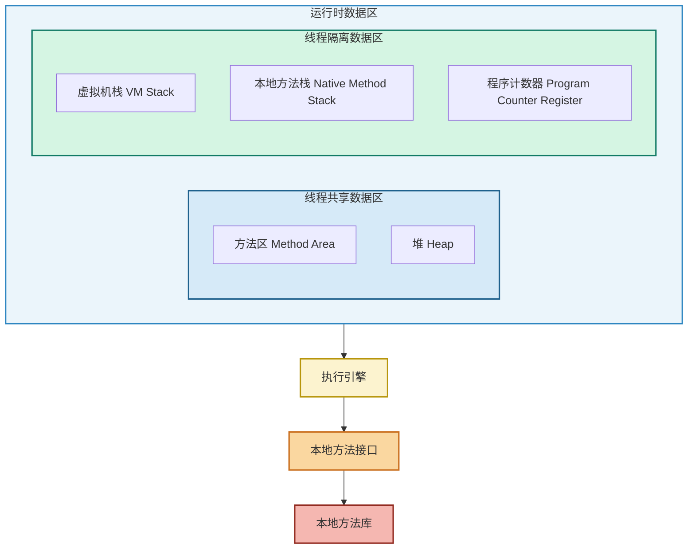
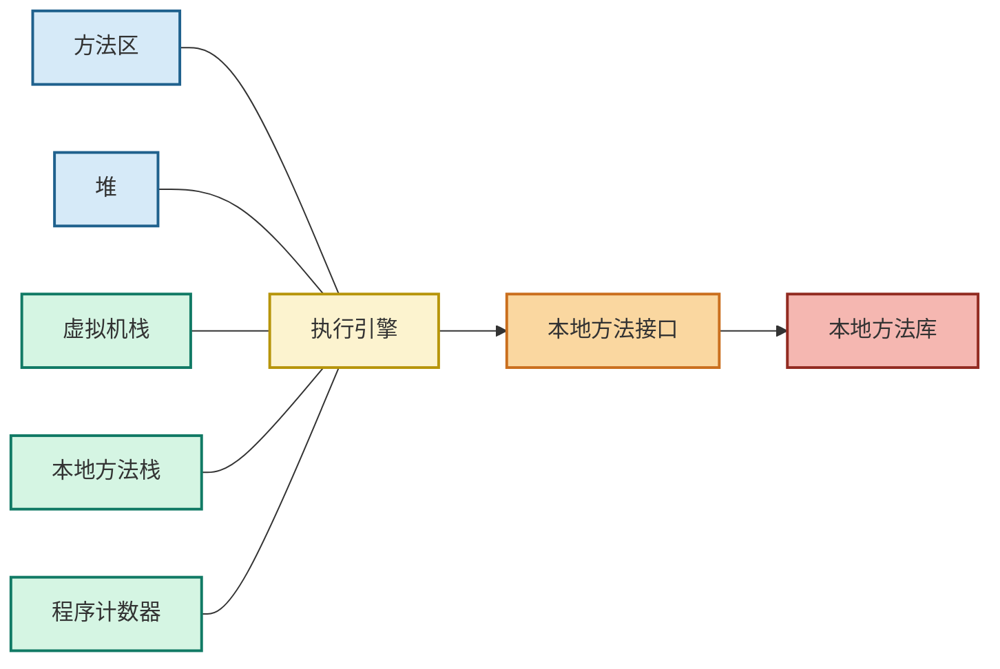
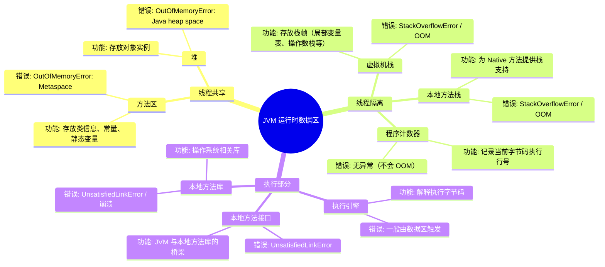

# Java 虚拟机运行时数据区

## 一、内存结构

Java 虚拟机在运行时，将内存划分为若干个不同的数据区域：

### 1. 线程共享的数据区

- **方法区 (Method Area)**  
    存放已被虚拟机加载的类信息、常量、静态变量、即时编译器编译后的代码等。
    
- **堆 (Heap)**  
    存放对象实例，是垃圾收集器管理的主要区域。
    

### 2. 线程隔离的数据区

- **虚拟机栈 (VM Stack)**  
    每个线程独享，存放方法调用的栈帧（局部变量表、操作数栈、动态链接、方法出口等）。
    
- **本地方法栈 (Native Method Stack)**  
    为虚拟机使用到的 Native 方法服务。
    
- **程序计数器 (Program Counter Register)**  
    每个线程都有一个程序计数器，记录当前执行字节码的行号指示器。
    

---

## 二、运行时交互

- **执行引擎**  
    负责执行字节码指令，将字节码翻译为本地机器指令。
    
- **本地方法接口 (Native Interface)**  
    连接虚拟机与本地方法库。
    
- **本地方法库**  
    由操作系统或其他语言实现的方法库。
    

---

## 三、区域分类说明

- 🟦 **线程共享数据区**：方法区、堆
    
- 🟩 **线程隔离数据区**：虚拟机栈、本地方法栈、程序计数器
    

---

## 四、Mermaid 图示

### 分层结构（纵向）

### 交互关系（横向调用链）

### 思维导图（区域 → 功能 → 常见错误）

## 五、运行时数据区对照表

|区域|是否共享|主要功能|常见错误/异常|
|---|---|---|---|
|**方法区 (Method Area)**|共享|存放类信息、常量、静态变量、JIT 编译代码|`OutOfMemoryError: Metaspace`|
|**堆 (Heap)**|共享|存放对象实例，GC 的主要管理区域|`OutOfMemoryError: Java heap space`|
|**虚拟机栈 (VM Stack)**|私有|存放栈帧（局部变量表、操作数栈、动态链接、方法出口）|`StackOverflowError`、`OutOfMemoryError`|
|**本地方法栈 (Native Method Stack)**|私有|为 Native 方法提供栈支持|`StackOverflowError`、`OutOfMemoryError`|
|**程序计数器 (PC Register)**|私有|指示当前线程执行字节码的行号|无特定异常（唯一不会 OOM 的区域）|
|**执行引擎 (Execution Engine)**|共享|执行字节码，调度运行时数据区|错误多在数据区体现|
|**本地方法接口 (Native Interface)**|共享|JVM 与本地方法库的桥梁|`UnsatisfiedLinkError`|
|**本地方法库 (Native Libraries)**|共享|操作系统相关的本地方法实现|`UnsatisfiedLinkError`、本地崩溃|

## 六、总结

- **运行时数据区**
    
    - 线程共享：方法区、堆
        
    - 线程隔离：虚拟机栈、本地方法栈、程序计数器
        
- **执行引擎**
    
    - 负责执行字节码，调度数据区
        
- **本地方法接口**
    
    - 作为 JVM 与操作系统之间的桥梁
        
- **本地方法库**
    
    - 提供底层功能支持