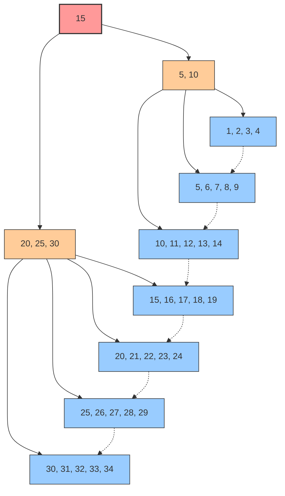
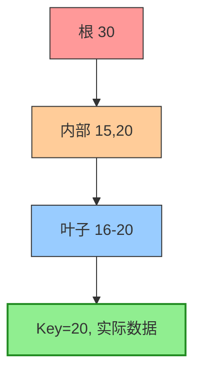
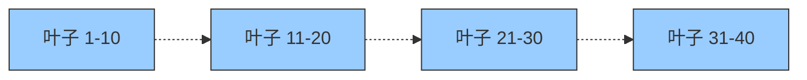
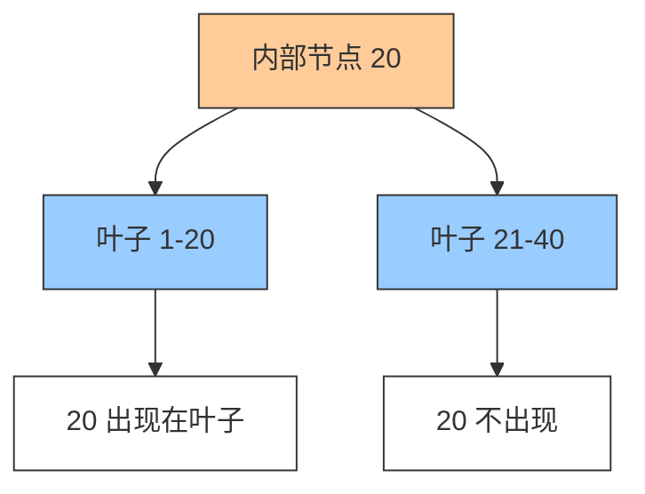
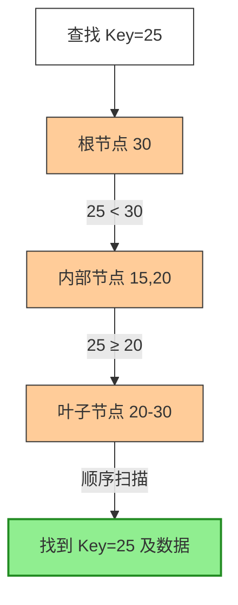
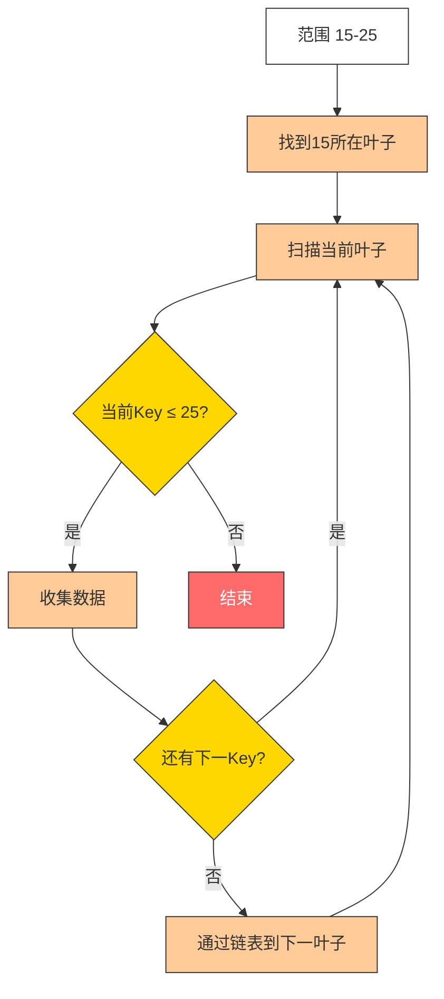
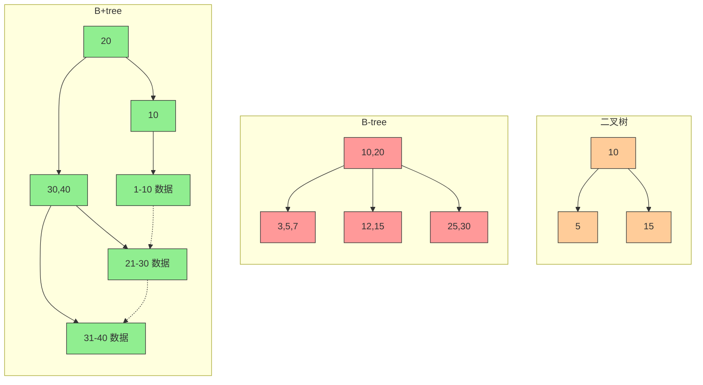
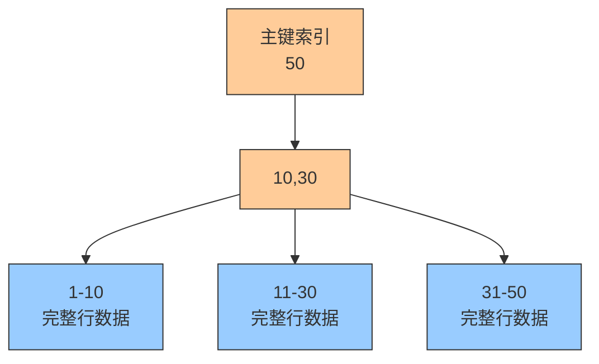
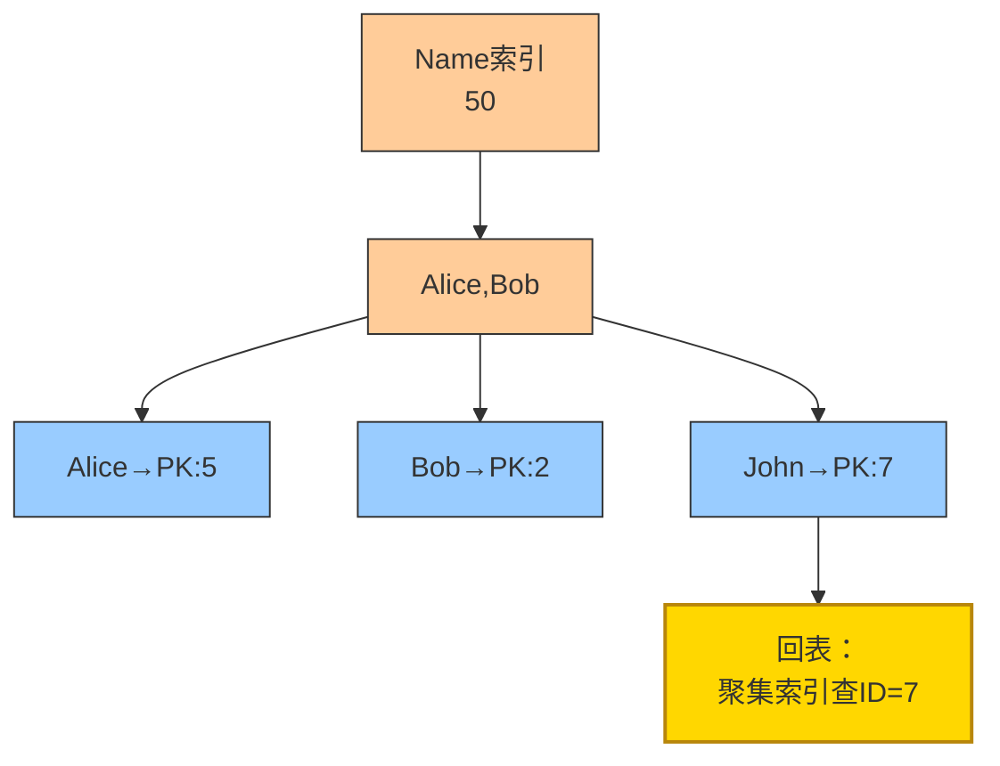
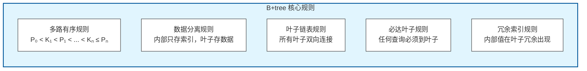

# B+tree (B+树)

## 1. 概念

**B+tree** 是B-tree的变种，**数据库索引的事实标准**。所有数据都存储在叶子节点，内部节点只存关键字作为索引，叶子节点通过指针相连形成有序链表。

> **MySQL InnoDB、Oracle、PostgreSQL** 等主流数据库的默认索引结构

---

## 2. B+tree 核心规则

### 2.1 多路有序规则

对于任意节点，假设其关键字为 `K₁ < K₂ < K₃ < ... < Kₙ`，则该节点的 `n+1` 个子树指针 `P₀, P₁, P₂, ..., Pₙ` 遵循：

```
P₀ 指向的子树：所有值 < K₁
P₁ 指向的子树：所有值 ∈ (K₁, K₂)
P₂ 指向的子树：所有值 ∈ (K₂, K₃)
...
Pₙ 指向的子树：所有值 ≥ Kₙ   （B+tree 特有的包含等于）
```

### 2.2 B+tree 特有规则

| 规则 | 说明 |
|------|------|
| **数据分离** | 内部节点只存关键字（作为索引），不存数据 |
| **全数据叶子** | 所有数据记录都存储在叶子节点 |
| **叶子链表** | 所有叶子节点通过指针连接成有序链表 |
| **查询必达叶子** | 任何查询都必须查找到叶子节点才能获取数据 |
| **冗余索引** | 内部节点的关键字会在叶子节点重复出现 |

### 2.3 与 B-tree 规则对比

| 规则项 | B-tree | B+tree |
|--------|--------|--------|
| 子树范围 | P₀ < K₁ < P₁ < K₂ < ... < Kₙ < Pₙ | P₀ < K₁ < P₁ < K₂ < ... < Kₙ ≤ Pₙ |
| 数据位置 | 所有节点 | 仅叶子节点 |
| 叶子连接 | 无 | 双向链表 |
| 查询终点 | 任意节点 | 必须到叶子 |

---

## 3. 结构图解

### 经典B+tree结构（3阶）



### 规则验证

| 父节点 | 子节点 | 验证规则 |
|--------|--------|----------|
| [15] | [5,10] | 所有值 < 15 ✓ |
| [15] | [20,25,30] | 所有值 ≥ 15 ✓ |
| [5,10] | [1,2,3,4] | 所有值 < 5 ✓ |
| [5,10] | [5,6,7,8,9] | 5 ≤ 值 < 10 ✓ |
| [5,10] | [10,11,12,13,14] | 10 ≤ 值 < 15 ✓ |
| [20,25,30] | [15,16,17,18,19] | 15 ≤ 值 < 20 ✓ |
| [20,25,30] | [20,21,22,23,24] | 20 ≤ 值 < 25 ✓ |
| [20,25,30] | [25,26,27,28,29] | 25 ≤ 值 < 30 ✓ |
| [20,25,30] | [30,31,32,33,34] | 值 ≥ 30 ✓ |

---

## 4. 核心特性详解

### 特性1：数据只存叶子



**规则说明**：
- 内部节点 [15,20] 只存储索引值，不存储数据
- 数据只在叶子节点 [16-20] 中存储

---

### 特性2：叶子链表连接



**规则说明**：
- 所有叶子节点通过双向链表连接
- 支持高效的范围查询和顺序扫描

---

### 特性3：冗余索引



**规则说明**：
- 内部节点的关键字 [20] 会在左子树的最大叶子中出现
- 这就是 B+tree 的"冗余索引"特性

---

## 5. 查找过程

### 等值查询（查找 Key=25）



**查找步骤**：
1. 根节点 [30]：25 < 30，走左子树
2. 内部节点 [15,20]：25 ≥ 20，走最右指针（子树 ≥ 20）
3. 叶子节点 [20-30]：顺序扫描找到25
4. **必须到叶子才能获取数据**（B+tree 核心规则）

---
### 范围查询 (15-25)




**B+tree 分裂规则**（与 B-tree 的关键区别）：

| 对比 | B-tree | B+tree |
|------|--------|--------|
| **中间值处理** | 提升到父节点，不在子节点保留 | 提升到父节点，**同时保留在右子节点** |
| **数据完整性** | 每个值只出现一次 | 内部节点的值会在叶子冗余出现 |

---

## 7. 三大对比：二叉树 vs B-tree vs B+tree



### 详细对比表

| 维度 | 二叉树 | B-tree | B+tree |
|------|--------|--------|--------|
| **子节点数** | ≤2 | ≤m | ≤m |
| **数据存储** | 每个节点 | 所有节点 | 仅叶子节点 |
| **叶子连接** | 无 | 无 | 双向链表 |
| **树高度** | 高 | 中 | 最低 |
| **等值查询** | O(log n) | O(log n) | O(log n) |
| **范围查询** | O(n) | O(log n + k) | O(log n + k) ⭐ |
| **全表扫描** | O(n) | O(n) | O(n) 顺序IO ⭐ |
| **空间利用率** | - | ~50% | ~75% ⭐ |
| **查询稳定性** | 不稳定 | 不稳定 | 稳定（必到叶子）⭐ |
| **适用场景** | 内存运算 | 文件系统 | 数据库索引 ⭐ |

---

## 8. 数据库实战：InnoDB索引

### 聚集索引 (Clustered Index)



**特点**：
- 叶子节点存储**完整行数据**
- 按主键排序存储
- 表数据本身就是索引结构

---

### 二级索引 (Secondary Index)



**特点**：
- 叶子节点存储**主键值**（不是完整行）
- 需要**回表**到聚集索引查询完整数据

---

## 9. 为什么B+tree是数据库之王？

| 优势 | 说明 | 规则体现 |
|------|------|----------|
| **磁盘友好** | 节点对齐磁盘页，一次IO读满一页 | 多路设计，节点大小匹配页大小 |
| **查询稳定** | 任何查询都到叶子，IO次数相同 | 查询必达叶子规则 |
| **范围无敌** | 链表结构支持高效顺序扫描 | 叶子链表规则 |
| **空间高效** | 内部节点不存数据，扇出更大 | 数据分离规则 |
| **并发友好** | 锁粒度优化适合高并发 | 读写分离，叶子锁 |

---

## 10. 关键参数（MySQL）

```sql
-- 查看页大小（默认16KB）
SHOW VARIABLES LIKE 'innodb_page_size';

-- 计算：16KB页，主键8B+指针6B=14B
-- 每节点约 16KB/14B ≈ 1170 个指针
-- 3层B+tree可存：1170 × 1170 × 16 ≈ 2千万 条记录
```

---

## 11. B+tree 规则总结



**记忆口诀**：
```
B+树有五大规：多路有序是基础
内部索引叶存数，叶子之间链成路
查询必须到叶子，冗余索引更稳固
范围扫描效率高，数据库之王不含糊
```
