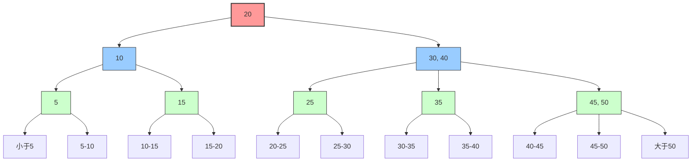
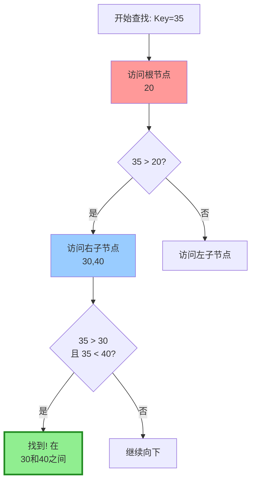
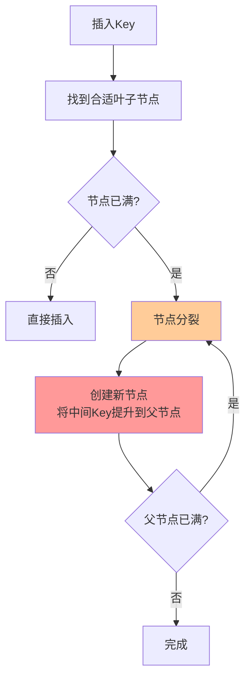
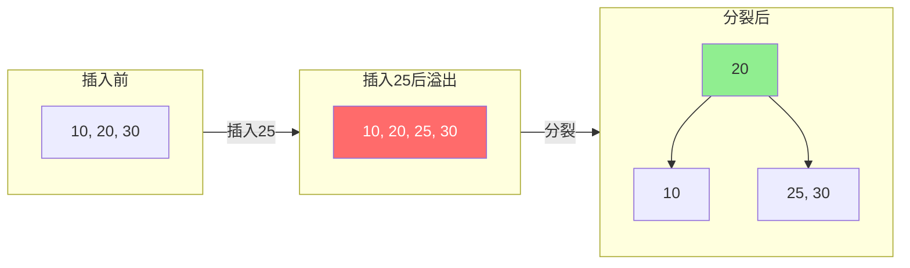
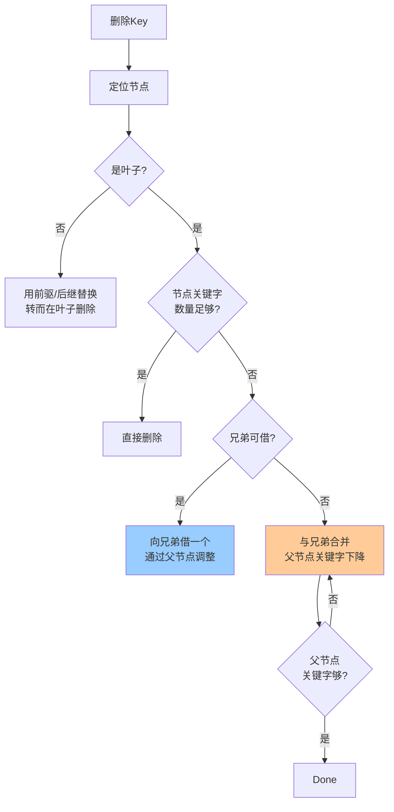
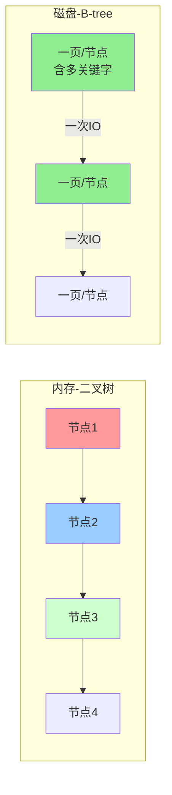

# B-tree (B树)

## 1. 概念

**B-tree** 是一种 **多路平衡搜索树**，专为 **磁盘存储** 设计，所有叶子节点在同一层，保持绝对平衡。

> **B** 代表 **Balanced**（平衡）或 **Bayer**（发明者）

### 核心参数：阶数 m

- 每个节点最多有 **m 个子节点**
- 每个节点最多有 **m-1 个关键字**
- 根节点最少有 **2 个子节点**（除非它是叶子）
- 非根节点最少有 **⌈m/2⌉ 个子节点**

---

## 2. 结构图解

### 3阶B-tree (2-3树) 示例

### 节点内部结构

**规则**：`Key[i]` 是 `P[i]` 和 `P[i+1]` 之间的分界值

---

## 3. 查找过程

**查找步骤**：
1. 从根节点开始
2. 在节点内顺序/二分查找关键字
3. 根据比较结果进入对应子树
4. 重复直到找到或到达叶子

---

## 4. 插入与分裂

### 插入流程

### 分裂示意图（3阶B-tree插入25）

---

## 5. 删除与合并

### 删除流程

---

## 6. 核心特性对比

| 特性 | 二叉树 | B-tree |
|------|--------|--------|
| **子节点数** | ≤2 | ≤m (多路) |
| **节点关键字** | 1个 | 多个 (m-1个) |
| **树高度** | 较高 | 较矮（胖矮） |
| **存储位置** | 内存 | 磁盘/内存 |
| **IO次数** | 多 | 少（一次读一页） |
| **应用场景** | 内存运算 | 文件系统、数据库 |

---

## 7. 应用场景

| 系统/应用 | 使用B-tree原因 |
|----------|--------------|
| **NTFS文件系统** | 存储文件索引，减少磁盘寻道 |
| **HFS+ (Mac)** | 目录索引管理 |
| **MongoDB (旧版)** | 默认存储引擎WiredTiger使用B-tree |
| **SQL Server** | 非聚集索引 |
| **PostgreSQL** | 部分索引实现 |

---

## 8. 为什么适合磁盘？

**关键原因**：
1. **局部性原理**：一个节点大小 = 磁盘页大小（4KB），一次IO读入多个关键字
2. **降低高度**：100阶B-tree存1亿数据只需约4层
3. **顺序访问**：节点内关键字有序，支持范围查询

---

## 9. 优缺点

**✅ 优点**
- 磁盘IO次数少（树矮）
- 所有叶子同层，查询稳定 $O(\log n)$
- 支持范围查询
- 自平衡，无需重建

**❌ 缺点**
- 实现复杂（分裂、合并、借用逻辑）
- 空间利用率约50%（非满节点）
- 不适合全遍历（节点间指针不连续）

---

## 10. 与B+tree的关键区别

| 对比项 | B-tree | B+tree |
|--------|--------|--------|
| **数据存储** | 内部节点和叶子都存数据 | 只有叶子存数据 |
| **叶子节点** | 相互独立 | 链表连接 |
| **范围查询** | 需要中序遍历 | 直接顺序扫描叶子 |
| **查询稳定性** | 可能在内部节点命中 | 必查找到叶子 |
| **空间利用率** | 较低 | 更高 |

---

