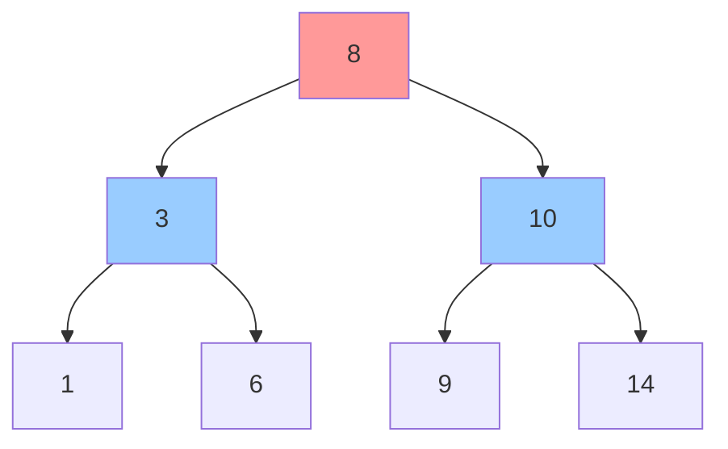

###  🔷 二叉搜索树 (BST - Binary Search Tree)

**规则**：左子树所有节点值 < 根节点值 < 右子树所有节点值



**操作时间复杂度**：
- 查找/插入/删除：平均 $O(\log n)$，最坏 $O(n)$（退化成链表）

---  


我们来分析一下 **BST（二叉搜索树）退化成链表** 的原因，并通过具体例子说明这一过程。

### 核心原因

BST 退化成链表的根本原因是：**插入的节点顺序，正好使得树的高度失去平衡，所有节点都偏向同一侧**。

-   **理想状态**：当数据随机插入时，树大致平衡，高度约为 log₂(n)，查找效率 O(log n)。
-   **退化状态**：当数据按有序或近似有序的顺序插入时，每一次新节点都成为前一个节点的右子节点（或左子节点），导致树变成一条线。此时高度等于节点数 n，查找效率退化为 O(n)，和链表一样。

---

### 举例说明

假设我们有一个空的二叉搜索树，按照以下顺序插入节点。

#### 场景一：按升序插入
依次插入节点：`5, 8, 12, 15, 18`

1.  **插入 5**：
    ```
        5
    ```

2.  **插入 8**：
    8 > 5，成为 5 的**右子节点**。
    ```
        5
         \
          8
    ```

3.  **插入 12**：
    12 > 5（向右），12 > 8（向右），成为 8 的**右子节点**。
    ```
        5
         \
          8
           \
           12
    ```

4.  **插入 15**：
    ```
        5
         \
          8
           \
           12
             \
             15
    ```

5.  **插入 18**：
    ```
        5
         \
          8
           \
           12
             \
             15
               \
               18
    ```

**结果**：这棵树已经完全退化成了一个**只有右子节点的链表**。此时查找节点 18 需要比较 5 次，时间复杂度为 O(n)。

#### 场景二：按降序插入
依次插入节点：`50, 40, 30, 20, 10`

过程逻辑与升序相反，所有节点都会成为上一个节点的**左子节点**，同样会形成一个向左延伸的链表。

```
        50
       /
      40
     /
    30
   /
  20
 /
10
```

### 总结

只要插入的数据是**有序的**（无论是递增还是递减），BST 就会发生退化。这也解释了为什么在实际应用中，单纯的基本 BST 并不常用，而是倾向于使用能够**自平衡**的树结构，比如红黑树、AVL 树等，来避免这种退化情况的发生。