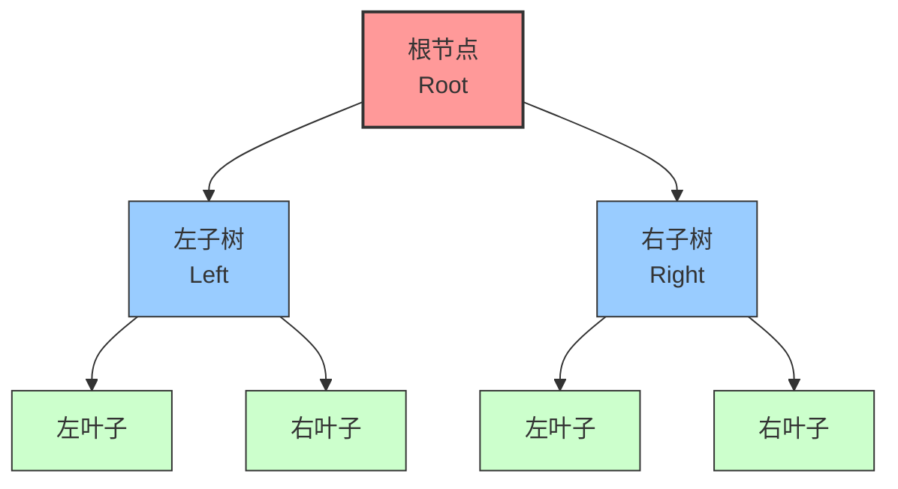
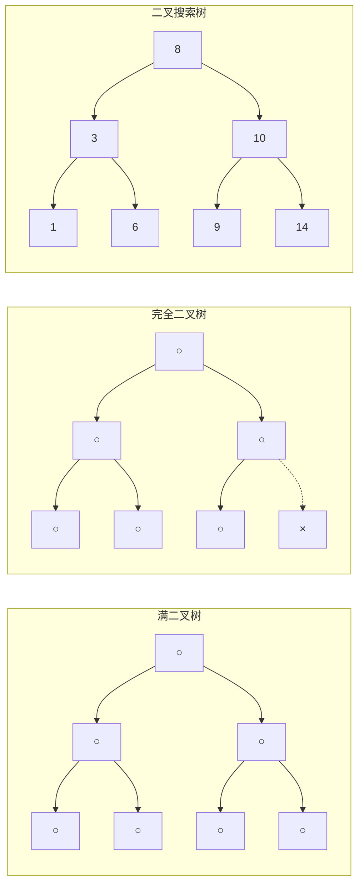

---
# 二叉树 (Binary Tree)

## 1. 概念

**二叉树**是每个节点最多有两个子树的树结构，分别称为**左子树**和**右子树**。

---

## 2. 结构图解

### 基本二叉树结构

```mermaid
graph TD
    A[根节点<br/>Root] --> B[左子树<br/>Left]
    A --> C[右子树<br/>Right]
    B --> D[左叶子]
    B --> E[右叶子]
    C --> F[左叶子]
    C --> G[右叶子]
    
    style A fill:#ff9999,stroke:#333,stroke-width:2px
    style B fill:#99ccff,stroke:#333
    style C fill:#99ccff,stroke:#333
    style D fill:#ccffcc,stroke:#333
    style E fill:#ccffcc,stroke:#333
    style F fill:#ccffcc,stroke:#333
    style G fill:#ccffcc,stroke:#333
```

### 常见二叉树类型对比

```mermaid
graph LR
    subgraph 满二叉树
        A1[○] --> B1[○]
        A1 --> C1[○]
        B1 --> D1[○]
        B1 --> E1[○]
        C1 --> F1[○]
        C1 --> G1[○]
    end
    
    subgraph 完全二叉树
        A2[○] --> B2[○]
        A2 --> C2[○]
        B2 --> D2[○]
        B2 --> E2[○]
        C2 --> F2[○]
        C2 -.-> G2[×]
    end
    
    subgraph 二叉搜索树
        A3[8] --> B3[3]
        A3 --> C3[10]
        B3 --> D3[1]
        B3 --> E3[6]
        C3 --> F3[9]
        C3 --> G3[14]
    end
```

---

