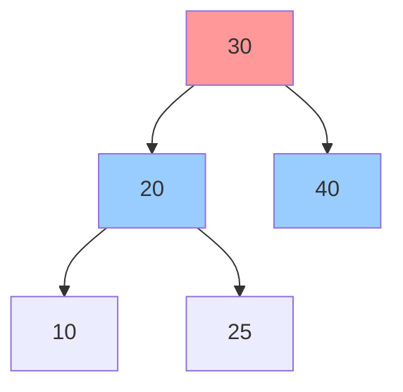

🔷 平衡二叉树 (AVL Tree)

**规则**：任意节点的左右子树高度差 ≤ 1

```mermaid
graph TD
    A[30] --> B[20]
    A --> C[40]
    B --> D[10]
    B --> E[25]
    
    style A fill:#ff9999
    style B fill:#99ccff
    style C fill:#99ccff
```

**特点**：通过旋转保持平衡，查找稳定 $O(\log n)$ 