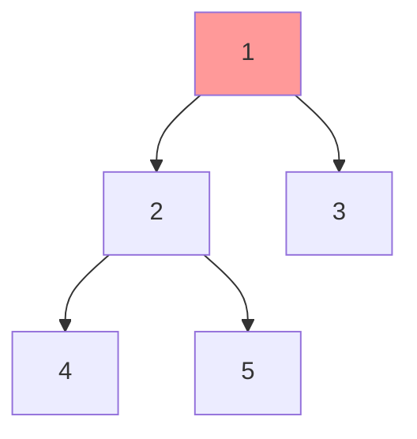

### 基本术语

| 术语 | 说明 |
|------|------|
| 根节点 (Root) | 树的最顶端节点 |
| 叶子节点 (Leaf) | 没有子节点的节点 |
| 父节点/子节点 | 直接相连的上下级关系 |
| 深度 (Depth) | 从根到该节点的边数 |
| 高度 (Height) | 从该节点到最远叶子的边数 |

###  遍历方式

| 遍历方式 | 顺序        | 记忆口诀    |
| ---- | --------- | ------- |
| 前序遍历 | 根 → 左 → 右 | **根**左右 |
| 中序遍历 | 左 → 根 → 右 | 左**根**右 |
| 后序遍历 | 左 → 右 → 根 | 左右**根** |
| 层序遍历 | 从上到下，从左到右 | 按层扫描    |



- **前序**：1 → 2 → 4 → 5 → 3
- **中序**：4 → 2 → 5 → 1 → 3  
- **后序**：4 → 5 → 2 → 3 → 1

---

### 应用场景 

| 场景              | 使用类型          | 原因                           |
| --------------- | ------------- | ---------------------------- |
| 数据库索引（内存）       | 红黑树           | 插入删除效率高                      |
| C++ STL map/set | 红黑树           | 平衡且高效                        |
| 表达式解析           | 普通二叉树         | 天然递归结构                       |
| 哈夫曼编码           | 哈夫曼树          | 最优前缀编码                       |
| 文件系统            | B-Tree/B+Tree | 适合磁盘存储（Mysq、Oracle、Postgrep） |

### 优缺点

**✅ 优点**
- 结构简单，易于理解
- 查找、插入、删除效率高（平衡时）
- 支持有序遍历

**❌ 缺点**
- 普通BST可能退化成链表（$O(n)$）
- 不适合磁盘存储（节点分散，IO次数多）
- 数据量大时，树高度增加，效率下降

### 代码速记（Python）

```python
class TreeNode:
    def __init__(self, val=0):
        self.val = val
        self.left = None
        self.right = None

# 中序遍历
def inorder(root):
    if root:
        inorder(root.left)
        print(root.val)
        inorder(root.right)
