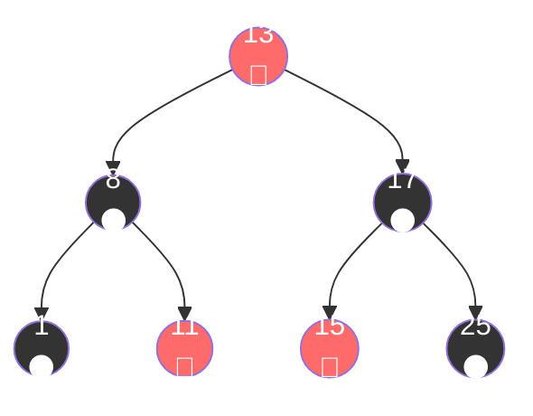

###  🔷 红黑树 (Red-Black Tree)

**规则**：带有颜色标记（红/黑）的自平衡BST

```mermaid
graph TD
    A((13<br/>🔴)) --> B((8<br/>⚫))
    A --> C((17<br/>⚫))
    B --> D((1<br/>⚫))
    B --> E((11<br/>🔴))
    C --> F((15<br/>🔴))
    C --> G((25<br/>⚫))
    
    style A fill:#ff6b6b,color:#fff
    style B fill:#333,color:#fff
    style C fill:#333,color:#fff
    style D fill:#333,color:#fff
    style E fill:#ff6b6b,color:#fff
    style F fill:#ff6b6b,color:#fff
    style G fill:#333,color:#fff
```
